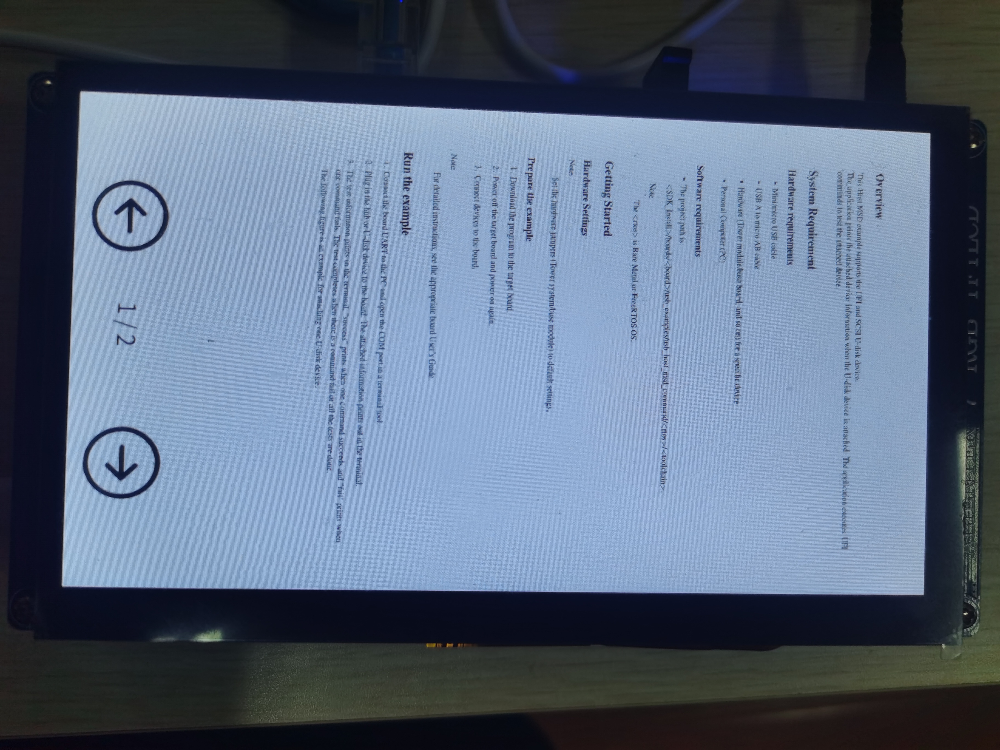

# PDFReader

A PDFReader by Qt, based on MuPDF

Board: Alientek alpha-IMX6ULL

Qt: 5.12.9

MuPDF: 1.12.0

Convert each page of PDF into an image and display it on the screen, the page turning logic is similar to WeChat Reading

**Note: You need to modify the library and include path of MuPDF in the .pro file to your own path**